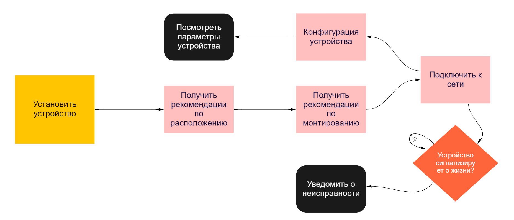

## Установка устройства

Устройство может быть, как предустановлено в дом при постройке, так и установлено пользователем
самостоятельно, учитывая предпочтение "Настраиваемость дома". В таком случае, для самостоятельной
установки может потребоваться помощь в выборе расположения устройства и его монтирования. После
того как устройство готово к работе, пользователь должен увидеть его в общей сети умного дома и
понять, что с ним всё в порядке. С этого момента и в течении всего периода эксплуатации устройство
периодически сигнализирует о своей работоспособности, на случай выхода из строя. После того как
пользователь увидел, что устройство появилось в сети он может настроить его 

